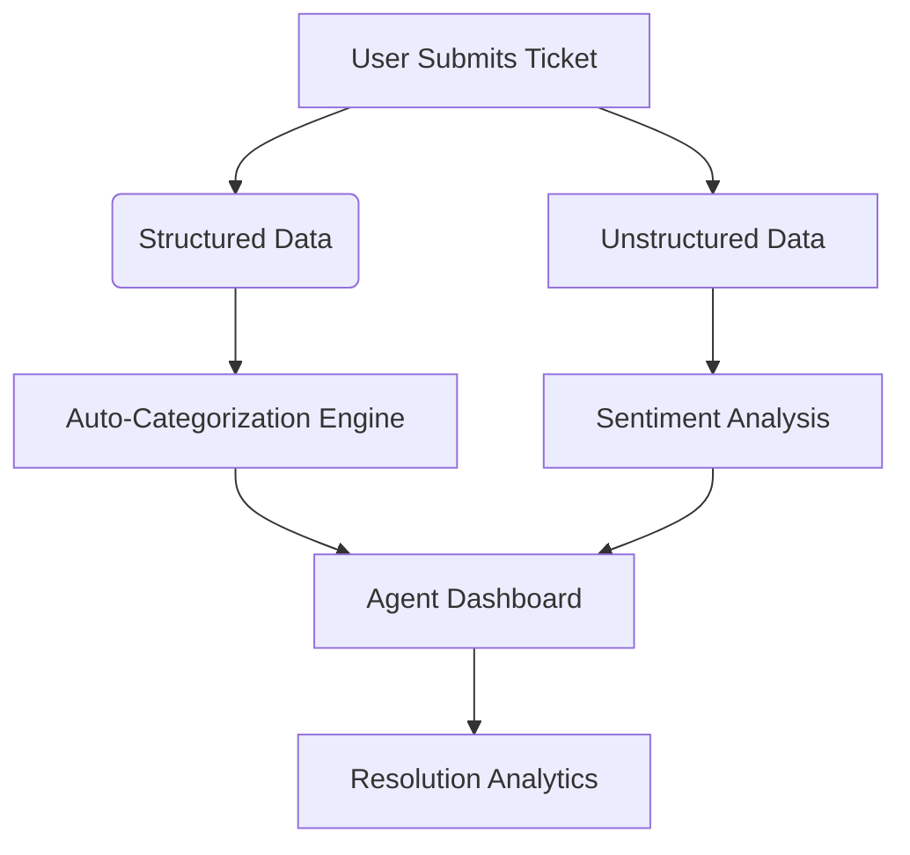

# 🚀 AI-Driven IT Support Automation  
**Reducing Resolution Times by 50% with LLMs and Proactive Analytics**  

 *Replace with a short demo GIF showing key features*

---

## 📌 Problem Statement  
Modern IT teams struggle with:  
- **Slow ticket resolution** due to manual triage and routing.  
- **Reactive workflows** that fail to anticipate recurring issues.  
- **Information overload** from unstructured data (emails, chat logs).  

This project tackles these challenges by **harnessing AI to automate Level 1 support workflows**.  

---

## 🛠️ Technical Innovation  
### Core Features  
| Feature | Tech Stack | Impact |  
|---------|------------|--------|  
| **Auto-Categorization** | Zero-shot LLM (Mistral-7B) + Hugging Face | 90% accurate ticket routing |  
| **AI-Powered Chatbot** | RAG (FAISS + LangChain) | 60% deflection of repetitive queries |  
| **Proactive Alerts** | BERTopic + Threshold Analytics | 40% faster incident detection |  
| **Resolution Analytics** | FastAPI + Recharts | Real-time KPI tracking |  

### Key Differentiators  
1. **Hybrid Data Pipeline**: Combines structured ticket metadata with unstructured chat/email analysis.  
2. **Cost-Efficient AI**: Uses open-source LLMs (Mistral-7B) instead of expensive GPT-4 calls.  
3. **Context-Aware RAG**: VectorDB retrieves solutions from both historical tickets and documentation.  

---

## ⚙️ Technical Implementation  
### Architecture  

## Tech Stack

# Frontend:

- React + Vite
- TailwindCSS
  
# Backend:
- FastAPI
- OpenAI (gpt-3.5-turbo)

# AI/ML:
- LangChain
- Langchain tool chains

## 🚨 Future Roadmap

- **Multi-Language Support: Expand beyond English tickets**
- **SLA Predictor: AI-driven ETA for ticket resolution**
- **Knowledge Base Builder: Auto-generate FAQs from resolved tickets**

# Backend
- cd fastapi
- pip install -r requirements.txt
- uvicorn categories:app --reload

# Frontend 
- cd ../datathon3
- npm install
- npm run dev

## 📽️ Demo Video

**Watch 3-Minute Demo** - https://youtu.be/I4e7HpWgezs?si=QlV0Cda2FBfeJER0

